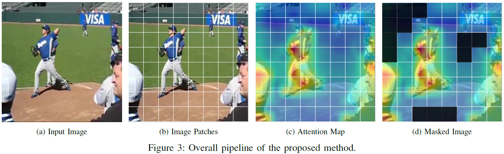

# Attention Masking for Improved Near Out-of-Distribution Image Detection (BigComp2023, Oral)

["Attention Masking for Improved Near Out-of-Distribution Image Detection"](https://ieeexplore.ieee.org/abstract/document/10066676/?casa_token=PsE2q08RVUwAAAAA:q51R7tSpZ__2Y5_bIKj4bc9GTL__NSXrInvBvvMHywaP04hjkvh8j3WtsKv_sJAahyZohbgpog). BigComp2023 Oral.\
Minho Sim, Jongwhoa Lee, and Ho-Jin Choi\
Korea Advanced Institute of Science and Technology


## Overview


## Dependencies

Install dependencies:

```
pip install -r requirements.txt
```

Setup project:

```
pip install .
```

## Attention Masking

Visualization of the proposed method


## Citation

If you find this repository useful, please consider citing:

```
@article{sim2023attention,
  title={Attention Masking for Improved Near Out-of-Distribution Image Detection},
  author={Sim, Minho and Lee, Jongwhoa, and Choi, Ho-Jin},
  journal={BigComp},
  year={2023},
}
```

## Acknowledgement

Our implementations of the vision transformer and attention rollout algorithm are heavily inspired by [vit-pytorch](https://github.com/lucidrains/vit-pytorch) and [vit-explain](https://github.com/jacobgil/vit-explain).
